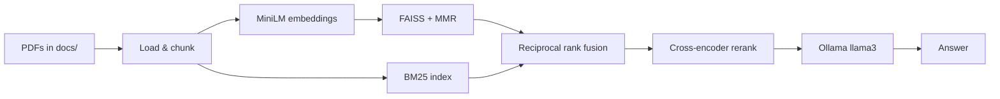

# basic_rag

A collection of **Retrieval-Augmented Generation (RAG)** experiments in Python, from minimal FAISS demos to a modular pipeline with hybrid retrieval, reranking, and a FastAPI API. The repo is organized as a learning path: start with small scripts in the root, then explore `multi_pdf_rag/` and `rag_system/` for fuller setups.

## Features

- **Vector search** with [FAISS](https://github.com/facebookresearch/faiss) and [sentence-transformers](https://www.sbert.net/) (`all-MiniLM-L6-v2`)
- **PDF ingestion** via PyMuPDF / LangChain loaders
- **Hybrid retrieval** — dense (FAISS + MMR) + sparse (BM25), merged with reciprocal rank fusion
- **Cross-encoder reranking** (`BAAI/bge-reranker-base`)
- **Local LLMs** via [Ollama](https://ollama.com/) (default: `llama3`)
- **Optional OpenAI** chat example (`hello.py`)
- **UIs** — Streamlit apps for single-PDF and multi-PDF chat
- **HTTP API** — FastAPI endpoint for the structured `rag_system` pipeline

## Project layout

```
basic_rag/
├── rag_demo.py          # Minimal FAISS + embeddings (hardcoded docs)
├── rag_free.py          # Same pattern, slightly larger doc list
├── rag_ollama.py        # FAISS retrieval + Ollama generation (no LangChain)
├── rag_pdf.py           # Single PDF: load, chunk, index, query via Ollama
├── reranker.py          # Standalone cross-encoder rerank demo
├── lang_chain.py        # LangChain + FAISS + Ollama (in-memory docs)
├── lang_chain_pdf.py    # LangChain RAG on data.pdf
├── app.py               # Streamlit: upload PDF, chat with Ollama
├── hello.py             # OpenAI Responses API tutor (uses env var for key)
├── data.pdf             # Sample PDF for root-level scripts
│
├── multi_pdf_rag/       # Multi-document RAG over docs/*.pdf
│   ├── build_db.py      # Build FAISS index → vector_store/
│   ├── app.py           # CLI chat over saved index
│   ├── app_streamlit.py # Streamlit UI
│   ├── rag_bm25.py      # Hybrid BM25 + vector + Ollama
│   ├── rag_reranker.py  # Adds cross-encoder reranking
│   └── docs/            # Place PDFs here
│
└── rag_system/          # Modular production-style pipeline
    ├── api.py           # FastAPI: POST /chat
    ├── docs/            # Source PDFs
    └── rag/
        ├── config.py
        ├── loader.py
        ├── embeddings.py
        ├── retriever.py   # HybridRetriever
        ├── reranker.py
        ├── llm.py
        └── pipeline.py
```

## Prerequisites

- **Python 3.10+** (3.11 tested)
- **[Ollama](https://ollama.com/)** installed and running for most RAG flows:
  ```bash
  ollama pull llama3
  ```
- **Optional:** OpenAI API key for `hello.py` only

## Setup

1. Clone the repository:
   ```bash
   git clone https://github.com/abraffay/basic_rag.git
   cd basic_rag
   ```

2. Create a virtual environment and install dependencies (no `requirements.txt` in repo yet; typical packages):
   ```bash
   python -m venv .venv
   source .venv/bin/activate   # Windows: .venv\Scripts\activate
   pip install \
     fastapi uvicorn streamlit \
     sentence-transformers faiss-cpu numpy \
     pymupdf rank-bm25 requests openai \
     langchain-core langchain-community langchain-text-splitters
   ```

3. **Never commit API keys.** Use environment variables:
   ```bash
   export OPENAI_API_KEY="your-key-here"   # only for hello.py
   ```
   Or store secrets in a `.env` file (already listed in `.gitignore`).

## Quick start

### 1. Smallest retrieval demo

```bash
python rag_demo.py
```

Runs a tiny in-memory corpus through FAISS and prints search results for a sample query.

### 2. Single PDF (script)

Put a PDF at the repo root or use `data.pdf`, then:

```bash
python rag_pdf.py
```

### 3. Single PDF (Streamlit)

```bash
streamlit run app.py
```

Upload a PDF in the browser and chat; answers use Ollama locally.

### 4. Multi-PDF RAG

Add PDFs under `multi_pdf_rag/docs/`, then build the index:

```bash
cd multi_pdf_rag
python build_db.py
```

Chat options:

```bash
python app.py                    # terminal
streamlit run app_streamlit.py   # UI
python rag_bm25.py               # hybrid retrieval
python rag_reranker.py           # hybrid + reranker
```

### 5. Modular system + API

Place PDFs in `rag_system/docs/`, then from `rag_system/`:

```bash
cd rag_system
uvicorn api:app --reload
```

- Health: `GET http://127.0.0.1:8000/`
- Ask: `POST http://127.0.0.1:8000/chat` with JSON `{"query": "your question"}`

Example:

```bash
curl -X POST http://127.0.0.1:8000/chat \
  -H "Content-Type: application/json" \
  -d '{"query": "What is on the resume?"}'
```

On startup, `rag_system` loads PDFs, chunks them, builds the hybrid retriever and reranker, and wires Ollama for generation. Models and paths are configured in `rag_system/rag/config.py`.

## How the main pipeline works



| Stage | Implementation |
|--------|----------------|
| Embeddings | `sentence-transformers/all-MiniLM-L6-v2` |
| Vector store | FAISS (in-memory or `vector_store/` on disk) |
| Sparse search | BM25 over tokenized chunks |
| Fusion | Reciprocal rank fusion in `HybridRetriever` |
| Rerank | `BAAI/bge-reranker-base` (top 5 chunks to LLM) |
| LLM | Ollama `llama3` via LangChain |

## Configuration

| Setting | Location | Default |
|---------|----------|---------|
| Docs folder | `rag_system/rag/config.py` | `rag_system/docs/` |
| Embedding model | `config.py` | `all-MiniLM-L6-v2` |
| Reranker | `config.py` | `BAAI/bge-reranker-base` |
| Ollama model | `config.py` | `llama3` |
| Chunk size | loaders / `build_db.py` | 500 tokens, overlap 50 |

## Security

- Do **not** hardcode API keys in source files.
- If a key was ever committed, **rotate it** in the provider dashboard and rewrite git history before pushing.
- GitHub push protection may block pushes that contain detected secrets.

## License

MIT — see [LICENSE](LICENSE).
